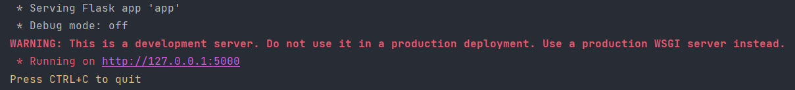

# 数据挖掘大作业--算法分析及数据可视化 后端部分

本项目为本人于云南大学本科人工智能专业就读期间，2023年秋季学期数据挖掘课程大作业的后端部分

## 代码结构
```
DataMining
│   clean.py
│   README.md
│   requirements.txt
│   test.py
│
├───data
│       abalone.csv
│       abalone.data
│       abalone.names
│       Index
│
├───DBSCAN
│       DBSCAN.py
│
├───DecisionTree
│       decision_tree.py
│
├───DNN
│       DNN.py
│       NeuralNetworkConfusionMatrix.png
│       NeuralNetworkROC.png
│
├───Kmeans
│       kmeans.py
│
├───NaiveBayes
│       ImproveTest.py
│       NaiveBayes.py
│       NaiveBayesConfusionMatrix.png
│       NaiveBayesROC.png
│
├───RandomForest
│       random_forest.py
│
├───Server
│   │   algorithms.py
│   │   app.py
│   │   Sql_Init.py
│   │
│   ├───models
│   │       decision_tree.pkl
│   │       mlp.pth
│   │       naive_bayes.pkl
│   │       random_forest.pkl
│   │       svm.pkl
│   │
│   ├───static
│   │   └───uploads
│   └───templates
│
└───SVM
        svm.py
```  
`./data` 下为数据集内容，其余文件夹为各算法的实验代码，其中后端需要的所有文件都包含在 `./Server` 文件夹下。  

## Usage
### 安装项目依赖
项目依赖包含
```
Flask==3.0.0
Flask_Cors==4.0.0
matplotlib==3.8.2
numpy==1.26.2
pandas==2.1.4
PyMySQL==1.1.0
scikit_learn==1.3.2
torch==2.1.1+cu121
```
首先运行 
```
pip install -r requirements.txt
```  

**注：本项目基于GPU环境搭建，如无GPU环境，请自行下载CPU环境pytorch并自行对代码进行修改**  


安装完依赖后，即可进行数据库的处理


### 数据库创建
**需要预先下载好MySQL数据库并完成相关配置，创建一个名为 `datamining` 的数据库**  
  
修改 **[./Server/Sql_Init](./Server/Sql_Init.py)** 中的相关配置参数，运行py文件  
  
完成数据库创建

### 运行服务器
修改 **[./Server/app.py](./Server/app.py)** 中关于数据库的相关配置参数，运行 **[Server](./Server/app.py)** 开放端口，出现以下图片即为正确运行  
<br/>


### 前端配置

前往 **[前端配置](../DataMiningWeb/README.md)**


## 郑重声明
* 本仓库仅供学习交流使用，禁止任何形式的商业行为  
* 不提倡任何形式的抄袭，如有抄袭，后果自负