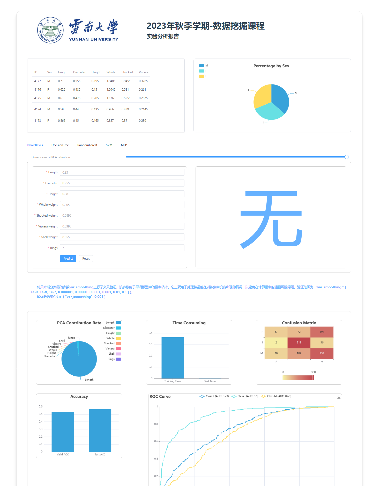

# DataMiningWeb

本项目为数据挖掘课程大作业的前端Web界面

## 安装依赖

首先确保你已经预先安装好了 **`node.js`** ，并对相关参数进行了配置。随后在本文件夹路径下运行以下命令： 

```sh
npm install
```

### 启动Web
确保你已经在 **`Server`** 中开启服务器，随后在本文件夹路径下运行以下命令启动开发服务器

```sh
npm run dev
```

### 运行截图



## 郑重声明
* 本仓库仅供学习交流使用，禁止任何形式的商业行为  
* 不提倡任何形式的抄袭，如有抄袭，后果自负